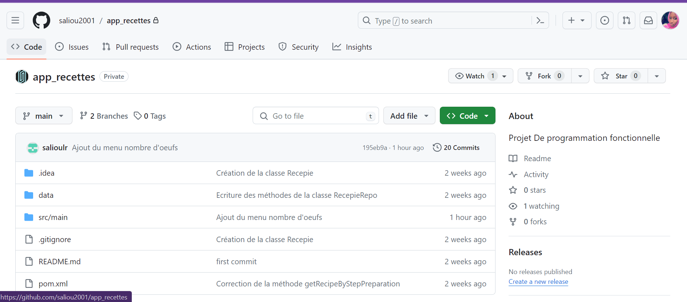
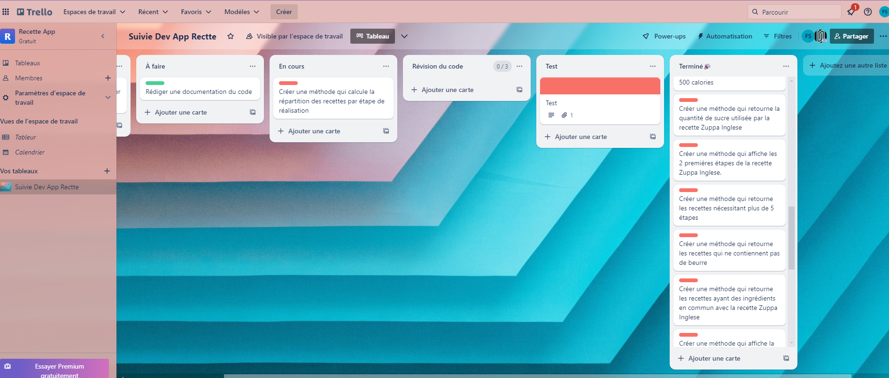

# Projet Mini Java - Application de traitement de recettes

### Participants  :
* BAH Saliou Bailo  
* SOW Fatou 
### Description
Ce projet consiste à créer une application Java permettant de manipuler des informations
provenant d'un fichier de recettes au format XML. L'objectif est d'utiliser le pattern Map/Filter/Reduce 
en s'appuyant sur l'API Stream pour effectuer différents traitements sur ces données de manière efficace.

### Outil de Gestion des Tâches
Nous avons adopté une approche collaborative où chaque membre de l'équipe était responsable de domaines 
spécifiques du projet. Cette répartition nous a permis de maximiser notre efficacité et de garantir 
une couverture complète des différents aspects du développement de l'application.
Nous avons utilisé les outils comme github pour la gestion du code source et la communication entre les membres de l'équipe
,Trello pour  nous aider à suivre l'avancement du projet  ainsi qu'une bonne communication et collaboration entre nous.
* ### `Utilisation de github`   
    * Création d'un repository sur github
    * Clonage du repository sur nos machines
    * Création de branches pour chaque fonctionnalité
    * Push des modifications sur les branches
    * Création de pull request pour fusionner les branches
    * Fusion des branches
    * Résolution des conflits
    * Push des modifications sur la branche principale
    * Pull des modifications sur les autres machines
 *  

*     

Voici le lien du repository : https://github.com/saliou2001/app_recettes.git
* ### `Utilisation de Trello`
    * Création d'un tableau sur Trello
    * Création de listes pour chaque fonctionnalité
    * Création de cartes pour chaque tâche
    * Attribution des tâches à chaque membre de l'équipe
    * Suivi de l'avancement des tâches  
    
    * 

Voici le lien du tableau : https://trello.com/b/LckhqDtU/suivie-dev-app-rectte
* ### `Communication et Collaboration`
    * La communication régulière et la collaboration étroite entre nous ont été des éléments clés pour la réalisarion de  ce projet.
    * Nous avons tenu des réunions régulières pour discuter de l'avancement du projet, résoudre les problèmes et prendre des décisions importantes.

### Outils Techniques

* ### `Scene Builder`
    - Nous avons utilisé Scene Builder pour la création de l'interface utilisateur de notre application.
    - Scene Builder nous a permis de concevoir facilement des interfaces graphiques en utilisant une approche glisser-déposer.
* ### ` JavaFX`
  - JavaFX a été utilisé comme framework pour le développement des fonctionnalités interactives de notre application.
  - Il nous a permis de créer une interface utilisateur dynamique et réactive, en offrant des composants graphiques avancés 
  et des capacités de personnalisation étendues.

### Structure du Projet
* ### `Structure des Packages Java`
  * ### ` models` 
    - Ce package contient les classes de modèle utilisées pour représenter les données des recettes, telles que la classe Recipe.
  * ### `presentation`
    - Ce package contient les classes responsables de l'interface utilisateur de l'application. Cela inclut RecepiePrincipale pour le menu principal et d'autres classes pour les différentes vues de l'application.
  * ### `Repositories `
    - Ce package contient les classes de gestion des données, comme RecipeRepo, responsable de la manipulation des données des recettes.
* ### ` Structure des Ressources`
  * ### ` css`
    - Ce répertoire contient les fichiers CSS utilisés pour la mise en forme de l'interface utilisateur. Ces fichiers peuvent définir les styles et les thèmes utilisés dans l'application.`     
  * ### ` images`
    - Ce répertoire contient les images utilisées dans l'interface utilisateur. Cela peut inclure des icônes, des logos, des images de recettes, etc.
  * ### ` Menu`
    - Ce répertoire contient les fichiers relatifs à la création du menu de l'application, notamment le fichier FXML (MenuGraphique.fxml) qui décrit la disposition des éléments graphiques dans le menu.
### Résultats
Avant même d'accéder aux fonctionnalités de l'application, les utilisateurs sont accueillis par une interface de choix.
Cette interface permet à l'utilisateur de sélectionner entre deux modes d'interaction : un menu textuel et un menu graphique. 

- 

Cette approche vise à offrir une expérience personnalisée et adaptée 
aux préférences de chaque utilisateur.
* ### `Menu Textuel`
  - Le menu textuel est une interface utilisateur simple qui permet à l'utilisateur de sélectionner une option à l'aide de commandes textuelles.
  
Aprés avoir choisi  l'option 1, l'utilisateur peut voir la liste des recettes disponibles et choisir une recette pour voir les détails.
  
Si on choisi l'option 2, l'utilisateur peut voir le nombre d'oeufs total utilisés.
 
* ### `Menu Graphique`
  - Ce mode d'interaction offre une interface utilisateur graphique plus visuelle, où les utilisateurs peuvent interagir avec l'application en utilisant des éléments graphiques tels que des boutons et 
  des menus déroulants. 
    - Interface d'accueil

